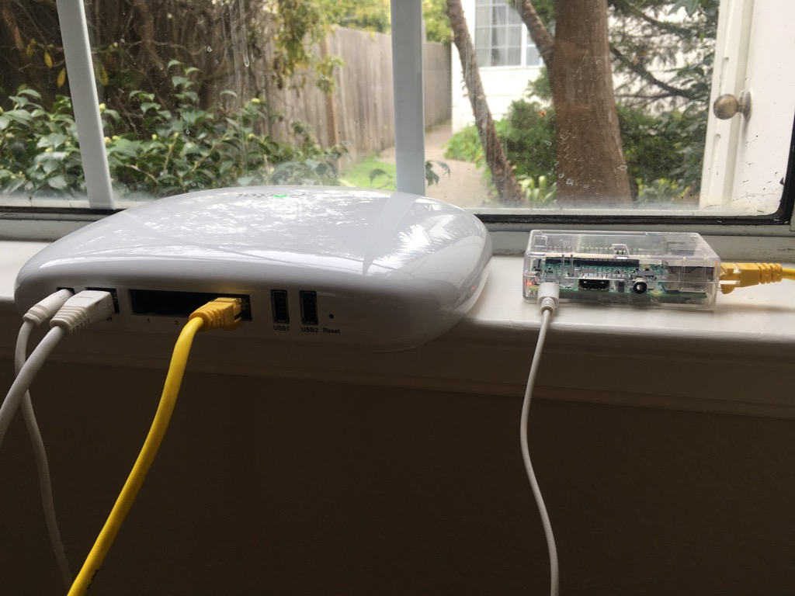
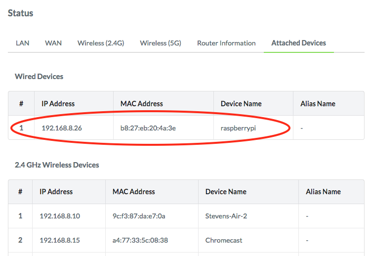
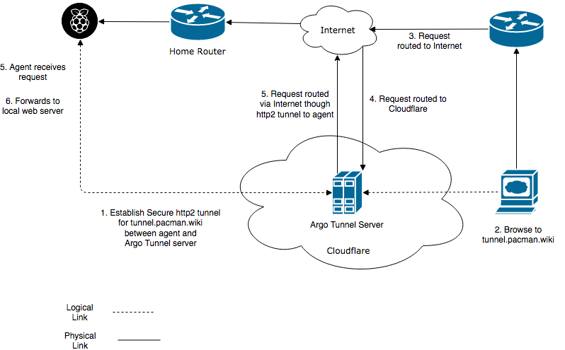
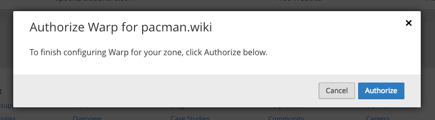
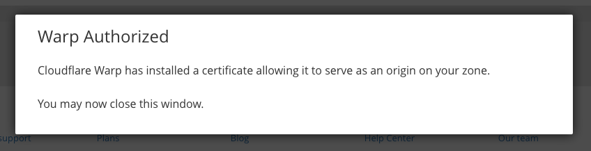
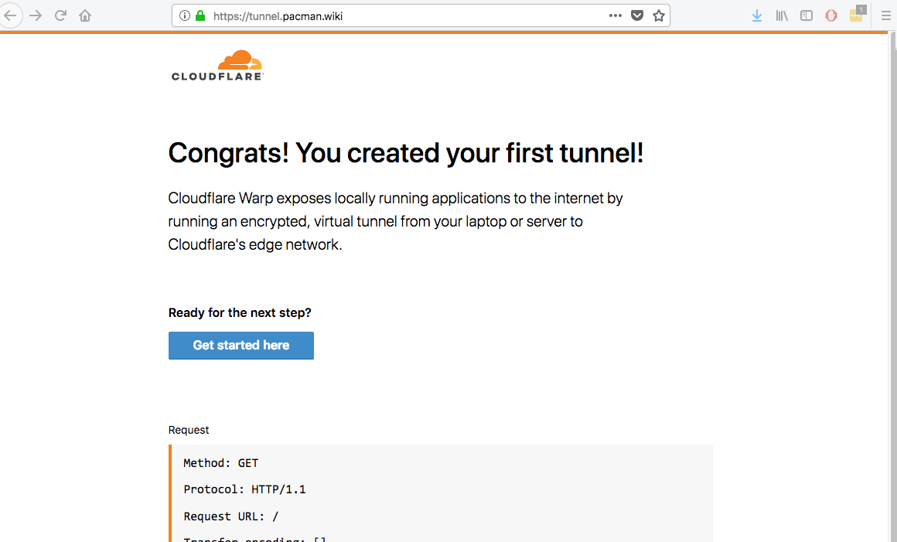
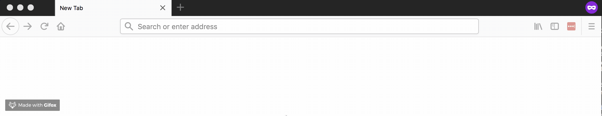

+++
title = "Cloudflare Argo Tunnel with Rust+Raspberry Pi"
description = "Serving content from a Rust web server running on a Raspberry Pi from your home to the world, with a Cloudflare Argo Tunnels"
date = 2018-04-06
+++

_First appeared on [https://blog.cloudflare.com/cloudflare-argo-tunnel-with-rust-and-raspberry-pi/](https://blog.cloudflare.com/cloudflare-argo-tunnel-with-rust-and-raspberry-pi/)_

Cloudflare recently released [Argo Tunnels](https://developers.cloudflare.com/argo-tunnel/). In the words of the product team:

> Argo Tunnels exposes applications running on your local web server, on any network with an Internet connection, without adding DNS records or configuring a firewall or router. It just works.

Once I grokked this, the first thing that came to mind was that I could actually use one of my Raspberry Pi's sitting around to serve a website, without:

- A flaky DDNS running on my router
- Exposing my home network to the world
- A cloud VM

Ooooh... so exciting. 

## The Rig
I'll assume you already have a Raspberry Pi with Raspbian on it.

Plug the Pi into your router. It should now have an IP address. Look that up in your router’s admin UI:

OK, that's promising. Let's connect to that IP using the default pi/raspberry credentials:

~~~~
$ ssh 192.168.8.26 -l pi
pi@192.168.8.26's password: 

The programs included with the Debian GNU/Linux system are free software;
the exact distribution terms for each program are described in the
individual files in /usr/share/doc/*/copyright.

Debian GNU/Linux comes with ABSOLUTELY NO WARRANTY, to the extent
permitted by applicable law.
Last login: Sun Mar 18 23:24:11 2018 from stevens-air-2.lan
pi@raspberrypi:~ $ 
~~~~

We're in!

**Pro tip: quick way to figure it out which type you have is**

~~~~
pi@raspberrypi:~ $ cat /proc/cpuinfo | grep 'Revision' | awk '{print $3}' | sed 's/^1000//'
a22082
~~~~
Then look up the value in the [Raspbery Pi revision history](https://elinux.org/RPi_HardwareHistory). I have Raspberry Pi 3 Model B

## Internet connectivity

OK, so we have a Pi connected to our router. Let's make 100% sure it can connect to the Internet.

~~~
pi@raspberrypi:~$ $ curl -I https://www.cloudflare.com
HTTP/2 200
date: Tue, 20 Mar 2018 22:54:20 GMT
content-type: text/html; charset=utf-8
set-cookie: __cfduid=dfb9c369ae12fe6eace48ed9b51aedbb01521586460; expires=Wed, 20-Mar-19 22:54:20 GMT; path=/; domain=.cloudflare.com; HttpOnly
x-powered-by: Express
cache-control: no-cache
x-xss-protection: 1; mode=block
strict-transport-security: max-age=15780000; includeSubDomains
x-content-type-options: nosniff
x-frame-options: SAMEORIGIN
served-in-seconds: 0.025
set-cookie: __cflb=3128081942; path=/; expires=Wed, 21-Mar-18 21:54:20 GMT
expect-ct: max-age=604800, report-uri="https://report-uri.cloudflare.com/cdn-cgi/beacon/expect-ct"
server: cloudflare
cf-ray: 3febc2914beb7f06-SFO-DOG
~~~

That first line HTTP/2 200 is the OK status code, which is enough to tell us we can connect out to the Internet. Normally this wouldn't be particularly exciting, as it's allowing connections **in** that causes problems. That's the promise of Argo Tunnels however, it says on the tin we don't need to poke any firewall holes or configure any DNS. Big claim, let's test it.

## Install the Agent

Go to https://developers.cloudflare.com/argo-tunnel/downloads/ to get the url for the ARM build for your Pi. At the time of writing it was https://bin.equinox.io/c/2ovkwS9YHaP/warp-stable-linux-arm.tgz

~~~
$ wget https://bin.equinox.io/c/2ovkwS9YHaP/warp-stable-linux-arm.tgz
--2018-03-18 23:42:22--  https://bin.equinox.io/c/2ovkwS9YHaP/warp-stable-linux-arm.tgz
Resolving bin.equinox.io (bin.equinox.io)... 54.243.137.45, 107.22.233.132, 50.19.252.69, ...
Connecting to bin.equinox.io (bin.equinox.io)|54.243.137.45|:443... connected.
HTTP request sent, awaiting response... 200 OK
Length: 5293773 (5.0M) [application/octet-stream]
Saving to: ‘warp-stable-linux-arm.tgz’

warp-stable-linux-arm.tgz          100%[=================================================================>]   5.05M   747KB/s   in 7.8s   

2018-03-18 23:42:31 (663 KB/s) - ‘warp-stable-linux-arm.tgz’ saved [5293773/5293773]
~~~

Untar it

~~~
$ mkdir warp
$ tar -xvzf warp-stable-linux-arm.tgz -C ./warp
cloudflare-warp
$ cd warp
$ ls
cloudflare-warp
$ ./cloudflare-warp --version
cloudflare-warp version 2018.3.0 (built 2018-03-02-1820 UTC)
~~~

The binary runs OK. Now, we're hoping that warp will magically connect from the Pi out to the nearest Cloudflare POP. We want that to be secure. Furthermore, we're expecting that when a request comes inbound, it magically gets routed through Cloudflare's network and back to my Raspberry Pi. Seems unlikely, but let's have faith. Here is my mental model of what's happening:

So let's create that secure tunnel. I guess we need some sort of certificate or credentials...

~~~
$ ./cloudflare-warp login
A browser window should have opened at the following URL:

https://www.cloudflare.com/a/warp?callback=https%3A%2F%2Flogin.cloudflarewarp.com%2FKG6M7NJNKSWK5PQ3U72JUFDBMKXCSOODASINUTMG5B4TRRZYR4G72JGSPSABKTON

If the browser failed to open, open it yourself and visit the URL above.
~~~

==This part assumes you already have a domain on Cloudflare== If you don't go to the [setup guide](https://support.cloudflare.com/hc/en-us/articles/201720164) to get started.

A browser's not going to open on our headless Pi, so let's put that url in the browser on my dev machine. We're being asked which domain we want this tunnel to sit behind. I've chosen **pacman.wiki**. Click Authorize.

You should now see this back on your pi:

~~~
You have successfully logged in.
If you wish to copy your credentials to a server, they have been saved to:
/home/pi/.cloudflare-warp/cert.pem
~~~

Aha! That answers how the tunnel gets secured. We've created a certificate. Now let's create the tunnel and serve some content!

`$ cloudflare-warp --hostname [hostname] --hello-world`

hostname is a fully-qualified domain name under the domain you chose to Authorize for Warp earlier. I'm going to use **tunnel.pacman.wiki**

~~~
$ ./cloudflare-warp --hostname tunnel.pacman.wiki --hello-world
INFO[0002] Autoupdate frequency is set to 24h0m0s       
INFO[0002] Proxying tunnel requests to https://127.0.0.1:46727 
INFO[0002] Starting Hello World server at 127.0.0.1:46727 
INFO[0002] Starting metrics server                       addr="127.0.0.1:54203"
INFO[0004] Connected to LAX                             
INFO[0004] There are currently 1 active tunnels for this zone. Your quota is 10  subsystem=rpc
INFO[0004] Registered at https://tunnel.pacman.wiki     
INFO[0004] Connected to SJC                             
INFO[0004] There are currently 1 active tunnels for this zone. Your quota is 10  subsystem=rpc
INFO[0004] Registered at https://tunnel.pacman.wiki     
INFO[0005] Connected to LAX                             
INFO[0005] There are currently 1 active tunnels for this zone. Your quota is 10  subsystem=rpc
INFO[0005] Registered at https://tunnel.pacman.wiki     
INFO[0006] Connected to SJC                             
INFO[0006] There are currently 1 active tunnels for this zone. Your quota is 10  subsystem=rpc
INFO[0006] Registered at https://tunnel.pacman.wiki     
~~~

Huh, interesting. So, we've connected to my nearest POP(s). I'm in Berkeley, so SJC and LAX seems reasonable. What now though? Surely that's not it? If I'm reading this right, I can go to my browser, enter https://tunnel.pacman.wiki and I'll get a hello world page... surely not.

And back on the Pi

~~~
INFO[0136] GET / HTTP/1.1                                client="127.0.0.1:46283"
INFO[0138] GET /favicon.ico HTTP/1.1                     client="127.0.0.1:46283"
~~~

Mind. Blown. So what happened here exactly...

1. The agent on the Pi created a secure tunnel (a persistent http2 connection) back to the nearest Cloudflare Warp server
1. The tunnel was secured with the certificate we generated
1. A request for tunnel.pacman.wiki went from my browser out through the Internet and eventually hit Cloudflare
1. Cloudflare got the request, saw the domain was Cloudflare managed and saw  a tunnel set up to that hostname.
1. The request got routed over that http2 connection back to my Pi

I'm serving traffic over the Internet, from my Pi, with no ports opened on my home router. That is so cool.  

#More than hello world

If you're reading this, I've won my battle with the Cloudflare blog editing team about long form vs short form content :p

Serving hello world is great, but I want to expose a real web server. If you're like me, if you can find any vaguely relevant reason to use Rust, then you use Rust. If you're also like me, you want to try one of these async web servers the cool kids talk about on [/r/rust](https://www.reddit.com/r/rust/) like [gotham](https://gotham.rs/). Let's do it.

First, install rust using [rustup](https://www.rustup.rs/).

`$ curl https://sh.rustup.rs -sSf | sh`

When prompted, just hit enter

~~~
1) Proceed with installation (default)
2) Customize installation
3) Cancel installation

...

  stable installed - rustc 1.24.1 (d3ae9a9e0 2018-02-27)

Rust is installed now. Great!
~~~

OK, Rust is installed. Now clone Gotham and build the hello_world example:

~~~
$ git clone https://github.com/gotham-rs/gotham
$ cd gotham
$ cd examples
$ cd hello_world
$ cargo build
~~~

**Pro tip:** if cargo is not found, run `source $HOME/.cargo/env`. It will be automatic in future sessions.

As cargo does its magic, you can think to yourself about how it's a great package manager, how there really are a lot of dependencies and how OSS really is standing on the shoulders of giants of giants of giants of giants, eventually you'll have the example built.

~~~
...
Compiling gotham_examples_hello_world v0.0.0 (file:///home/pi/warp/gotham/examples/hello_world)
    Finished dev [unoptimized + debuginfo] target(s) in 502.83 secs
    
$ cd ../../target/debug
$ ./gotham_examples_hello_world 
Listening for requests at http://127.0.0.1:7878
~~~

So now we have a rust web server listening on a local port. Let's create a tunnel between Cloudflare and my web server.

`./cloudflare-warp --hostname gotham.pacman.wiki http://127.0.0.1:7878`

Now type **https://gotham.pacman.wiki** into your web browser and you'll see those glorious words, "Hello, world". Oh, and it's ssl, with no setup on my part on the web server. No big deal.

#Wait, this was meant to be *more* than hello world.

OK, challenge accepted. Rust being fancy and modern is OK with Unicode. Let's serve some of that.

~~~
$ cd examples/hello_world/src/
$ nano src/main.rs 
~~~

Replace the hello world string:

`Some((String::from("Hello World!").into_bytes(), mime::TEXT_PLAIN)),` 

with some Unicode and a content-type hint so the browser know how to render it:

`Some((String::from("<html><head><meta http-equiv='Content-Type' content='text/html; charset=UTF-8'></head><body><marquee>Pᗣᗧ•••MᗣN</marquee></body></html>").into_bytes(), mime::TEXT_HTML)),`

Build and run

~~~
...
$ cargo build
...
./gotham_examples_hello_world 
Listening for requests at http://127.0.0.1:7878
~~~

`$ ./cloudflare-warp --hostname gotham.pacman.wiki http://127.0.0.1:7878`

And now we have some Unicode served from our Pi at home over the Internet, with no firewall ports open, by a highly asynchronous web server written in a fast, safe, high-level language. Cool.

## Are we done?

Oh, we should probably auto start on boot so it doesn't die when we end our ssh session.

~~~
$ sudo ./cloudflare-warp service install
INFO[0000] Failed to copy user configuration. Before running the service, ensure that /etc/cloudflare-warp contains two files, cert.pem and config.yml  error="open cert.pem: no such file or directory"
~~~

Nice error! OK, the product team have helpfully documented what to put in that file [here](https://developers.cloudflare.com/warp/reference/config/)

~~~
$ cd /etc/cloudflare-warp/
-bash: cd: /etc/cloudflare-warp/: Permission denied
$ sudo cp ~/.cloudflare-warp/cert.pem /etc/cloudflare-warp
$ sudo nano /etc/cloudflare-warp/config.yml
~~~

~~~ 
#config.yml
hostname: gotham.pacman.wiki
url: http://127.0.0.1:7878
~~~

~~~
$ sudo ./cloudflare-warp service install
INFO[0000] Using Systemd                                
ERRO[0000] systemctl: Created symlink from /etc/systemd/system/multi-user.target.wants/cloudflare-warp.service to /etc/systemd/system/cloudflare-warp.service.
 
INFO[0000] systemctl daemon-reload       
~~~

`nano /etc/rc.local`

Add line: `/home/pi/warp/server/bin/gotham_examples_hello_world &` just before `exit 0`

`sudo reboot`

On restart, ssh back in again and check both the agent and server are running.

~~~
$ sudo ps -aux | grep warp
root       501  0.1  0.2  37636  1976 ?        Sl   06:30   0:00 /home/pi/warp/server/bin/gotham_examples_hello_world
root       977 15.7  1.4 801292 13972 ?        Ssl  06:30   0:01 /home/pi/warp/cloudflare-warp --config /etc/cloudflare-warp/config.yml --origincert /etc/cloudflare-warp/cert.pem --no-autoupdate
~~~

Profit.

